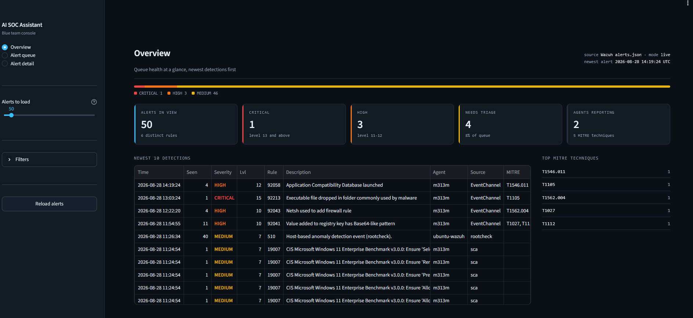
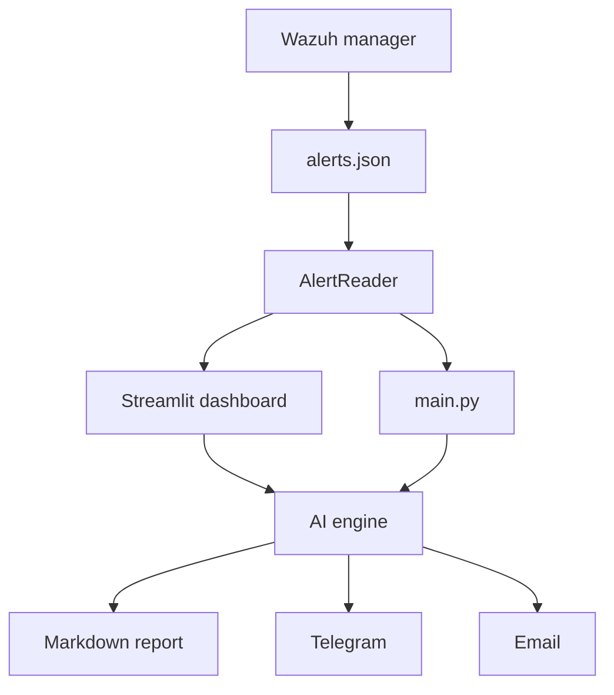
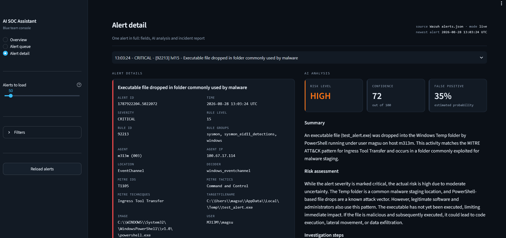
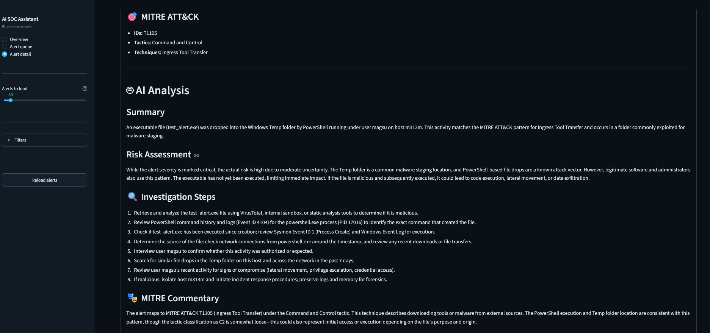
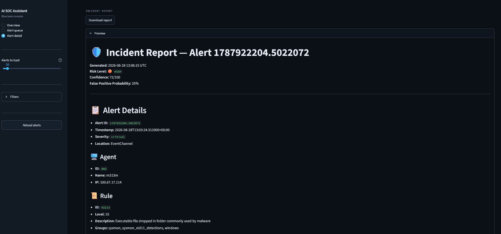

# 🤖 AI SOC Assistant

[](https://github.com/mags-mags-soc/ai-soc-assistant/actions/workflows/ci.yml)
[](https://www.python.org/)
[](LICENSE)

> An AI triage assistant for Wazuh: it answers what an alert means and
> what to do about it next.



---

# Overview

AI SOC Assistant is a modular Security Operations Center (SOC) platform designed to assist security analysts by automatically processing SIEM alerts, performing AI-assisted threat analysis, generating professional incident reports, and notifying analysts in real time.

The project follows a production-oriented software architecture using sprint-based development, automated testing, modular Python packages, and Git version control.

Current SIEM Platform

- Wazuh

Ingestion is isolated behind a protocol, so another SIEM means a new data
source rather than a rewrite.

---

# Features

## Current Features

- Wazuh alert reader with tail-based live source
- Alert parsing, severity mapping, MITRE ATT&CK extraction
- AI threat analysis with Pydantic-validated structured output
- Decoded Sysmon field extraction for Windows EventChannel alerts
- Streamlit triage dashboard with group expansion, filtering and search
- Markdown incident reports
- Telegram and SMTP notification channels
- Pipeline entry point with a processed-alert store
- 243 tests, 90% coverage

Planned Features

- Wazuh REST API ingestion
- Alert correlation across related events
- Digest notifications instead of one message per alert
- Analyst feedback loop on AI assessments
- IOC enrichment (VirusTotal, AbuseIPDB)
- Multi-SIEM support

---

# Architecture



---

# Technology Stack

| Category | Technology |
|------------|----------------|
| Language | Python 3 |
| SIEM | Wazuh |
| AI | Any OpenAI-compatible endpoint (Anthropic Haiku 4.5) |
| Validation | Pydantic v2 |
| Dashboard | Streamlit |
| Notifications | Telegram Bot API, SMTP |
| Reports | Markdown |
| Testing | Pytest |
| Version Control | Git |
| Repository | GitHub |
| Virtualization | Proxmox |
| Operating System | Ubuntu Server |

---

# Project Structure

```text
ai-soc-assistant/

backend/
└── src/
    └── soc/
        ├── ai/                 client, analyzer, prompts, schemas
        ├── notify/             telegram, email
        ├── report/             markdown_report
        ├── alert_reader.py
        ├── config.py
        ├── logging_setup.py
        ├── mitre.py
        ├── models.py
        ├── pipeline.py
        ├── severity.py
        └── state.py

dashboard/
├── data/                       AlertDataSource: sample, live
├── analysis/                   AnalysisSource: disabled, analyzer
├── components/
├── views/
└── filters.py

docs/
├── detections/
└── images/

scripts/
tests/

main.py
requirements.txt
requirements-dashboard.txt
pytest.ini
.gitignore
.env.example
README.md
ROADMAP.md
CHANGELOG.md
LICENSE
```

---

# Installation

Clone the repository

```bash
git clone https://github.com/mags-mags-soc/ai-soc-assistant.git

cd ai-soc-assistant
```

Create a virtual environment

```bash
python3 -m venv .venv
```

Activate the environment

Linux

```bash
source .venv/bin/activate
```

Install dependencies

```bash
pip install -r requirements.txt
```

---

# Configuration
Copy `.env.example` to `.env` and fill in what you need. Every section is
optional: without an AI key the dashboard runs with analysis disabled, and an
unconfigured notification channel is skipped rather than failing.

```text
AI_API_KEY=
AI_BASE_URL=https://api.anthropic.com/v1/
AI_MODEL=claude-haiku-4-5-20251001
AI_JSON_MODE=false

TELEGRAM_BOT_TOKEN=
TELEGRAM_CHAT_ID=

SMTP_HOST=
SMTP_PORT=587
SMTP_USERNAME=
SMTP_PASSWORD=
SMTP_SENDER=
SMTP_RECIPIENTS=

DASHBOARD_SOURCE=live
DASHBOARD_ANALYSIS_SOURCE=analyzer
DASHBOARD_MIN_LEVEL=7
```

`AI_JSON_MODE=false` is required for providers whose OpenAI compatibility layer
rejects `response_format: json_object`; structured output is still guaranteed
by Pydantic validation.

---


## Project documentation

- [Purpose and Roadmap](docs/PURPOSE_AND_ROADMAP.md) — the gap this fills, what
  it does today, its known limitations and where it goes next
- [Architecture](docs/ARCHITECTURE.md) — how the pieces fit, the two swappable
  protocol layers, and where the cost boundaries sit

### Detection engineering

- [Rule 92213 — PowerShell execution policy probe](docs/detections/92213-psscriptpolicytest.md)
  — one rule producing more alerts than every other rule combined, and how it
  was tuned without losing the evidence

---

# Running

Activate the virtual environment

```bash
source .venv/bin/activate
```

Run the application

Processes new alerts through analysis, notification and reporting. Alerts
already handled in an earlier run are skipped, so repeated runs do not
re-bill the AI provider.

```bash
python main.py --dry-run          # show what would be processed
python main.py --limit 1          # process a single alert
python main.py --min-level 12     # only high-severity alerts
```

Exit code is 0 on success and 1 when any alert failed.

### Scheduling

`main.py` is written to be scheduler-friendly — it skips already-handled
alerts and reports failure through its exit code — but no timer ships with the
project. Automation multiplies whatever the alert volume happens to be, so
rule tuning has to come first: in this lab a single untuned rule produced 175
benign alerts a day, and scheduling on top of that would have meant hundreds
of notifications and a daily provider bill for analysing noise.

To schedule it once your ruleset is tuned, a systemd timer calling
`python main.py --limit N` on an interval is enough.

---

# Testing

Run all tests

```bash
pytest
```

Run tests with coverage

```bash
pytest --cov-report=html
```

---

# Project status

`v0.5.0` · 243 tests · 90% coverage

Sprints 1 through 5 are complete: alert reader, AI engine, notification and
reporting, the Streamlit dashboard, and the pipeline entry point with its
processed-alert store.

See **[ROADMAP.md](ROADMAP.md)** for the full sprint table and the known gaps,
and **[docs/PURPOSE_AND_ROADMAP.md](docs/PURPOSE_AND_ROADMAP.md)** for where
the project goes next.

---

# Screenshots

### Alert detail

A deduplicated row expanded into the individual events behind it, with the AI
assessment alongside: risk level, confidence and a false-positive estimate.



### Incident report

Every analysed alert produces a downloadable Markdown report containing the
decoded event data, the assessment and the investigation steps.



Windows EventChannel alerts carry no `full_log`, so the report surfaces the
decoded Sysmon fields instead of an empty log section:



---

# Portfolio

This project was built as part of a personal cybersecurity portfolio focused on SOC Analyst and Blue Team responsibilities.

Project Goals

- Learn production-quality Python development
- Build modular software architecture
- Integrate AI into SOC workflows
- Practice secure software development
- Improve Git & GitHub workflow
- Practice detection engineering against real telemetry

---

# Development Workflow

Every sprint follows the same workflow.

```text
Architecture
      │
      ▼
Implementation
      │
      ▼
Testing
      │
      ▼
Git Commit
      │
      ▼
Git Push
      │
      ▼
Stable Release Tag
      │
      ▼
Proxmox Snapshot
```

---

# Release History

| Version | Description |
|-----------|-----------------------------|
| v0.1.0 | Sprint 1 — Alert reader |
| v0.2.0 | Sprint 2 — AI engine |
| v0.3.0 | Sprint 3 — Notification and reporting |
| v0.4.1 | Sprint 4.1 — Dashboard shell |
| v0.4.2 | Sprint 4.2 — Alert detail, AI panel, report viewer |
| v0.4.3 | Sprint 4.3a — Live Wazuh source |
| v0.4.4 | Sprint 4.3b — Group expansion, Sysmon field extraction |
| v0.4.5 | Sprint 4.3c — Filtering and search |
| v0.5.0 | Sprint 5 — Entry point, state store, notification channels |

---

# License

This project is licensed under the MIT License.

See the LICENSE file for more information.

---

# Contributing

Contributions, improvements and suggestions are welcome.

Please create a feature branch before submitting a Pull Request.

---

# Author

**Magsud Magsudlu**

Cybersecurity • SOC Analyst • Blue Team 

---

# Repository Status

Current Version

```
v0.5.0
```

Current Status

```
Sprint 5 stable
```
