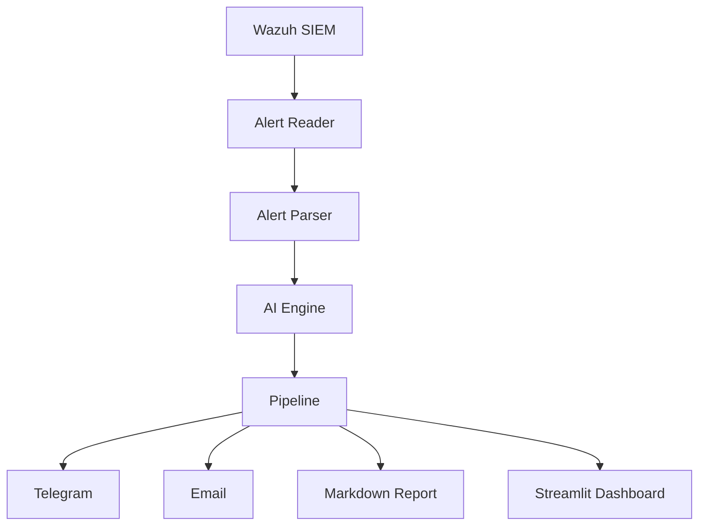

# 🤖 AI SOC Assistant

> Enterprise-grade AI-powered SOC Analyst Assistant built with Python, Wazuh, OpenAI, and Streamlit.

---

# Overview

AI SOC Assistant is a modular Security Operations Center (SOC) platform designed to assist security analysts by automatically processing SIEM alerts, performing AI-assisted threat analysis, generating professional incident reports, and notifying analysts in real time.

The project follows a production-oriented software architecture using sprint-based development, automated testing, modular Python packages, and Git version control.

Current SIEM Platform

- Wazuh

Planned Integrations

- Elastic Security
- Microsoft Sentinel
- Splunk
- IBM QRadar

---

# Features

## Current Features

- Wazuh Alert Reader
- Alert Parsing
- MITRE ATT&CK Mapping
- AI Threat Analysis
- Pydantic Validation
- Telegram Notifications
- Email Notification Engine
- Markdown Incident Reports
- Notification Pipeline
- Unit Tests
- Git Versioning

---

## Planned Features

- Streamlit Dashboard
- FastAPI REST API
- Live Alert Monitoring
- OpenAI Integration
- Redis Cache
- PostgreSQL
- Docker Deployment
- CI/CD Pipeline
- Threat Intelligence Integration
- VirusTotal Integration
- AbuseIPDB Integration
- IOC Enrichment
- Multi-SIEM Support

---

# Architecture



---

# Technology Stack

| Category | Technology |
|------------|----------------|
| Language | Python 3 |
| SIEM | Wazuh |
| AI | OpenAI API *(planned integration)* |
| Validation | Pydantic v2 |
| Dashboard | Streamlit *(in development)* |
| API | FastAPI *(planned)* |
| Notifications | Telegram Bot API, SMTP |
| Reports | Markdown |
| Testing | Pytest |
| Version Control | Git |
| Repository | GitHub |
| Virtualization | Proxmox |
| Operating System | Ubuntu Server |

---

# Project Structure

```text
ai-soc-assistant/

backend/
└── src/
    └── soc/
        ├── ai/
        ├── notify/
        ├── report/
        ├── alert_reader.py
        ├── config.py
        ├── logging_setup.py
        ├── mitre.py
        ├── models.py
        ├── pipeline.py
        └── severity.py

dashboard/
scripts/
tests/

requirements.txt
requirements-dashboard.txt
pytest.ini
.gitignore
.env.example
README.md
ROADMAP.md
CHANGELOG.md
LICENSE
```

---

# Installation

Clone the repository

```bash
git clone https://github.com/<YOUR_USERNAME>/ai-soc-assistant.git

cd ai-soc-assistant
```

Create a virtual environment

```bash
python3 -m venv .venv
```

Activate the environment

Linux

```bash
source .venv/bin/activate
```

Install dependencies

```bash
pip install -r requirements.txt
```

---

# Configuration

Create a `.env` file.

Example:

```text
OPENAI_API_KEY=

TELEGRAM_BOT_TOKEN=

TELEGRAM_CHAT_ID=

SMTP_HOST=

SMTP_PORT=

SMTP_USER=

SMTP_PASSWORD=
```

---

# Running

Activate the virtual environment

```bash
source .venv/bin/activate
```

Run the application

```bash
python main.py
```

*(The main entry point will be introduced in a future sprint.)*

---

# Testing

Run all tests

```bash
pytest
```

Run tests with coverage

```bash
pytest --cov=backend/src
```

---

# Current Project Status

| Sprint | Status |
|----------|-----------|
| Sprint 1 — Alert Reader | ✅ Completed |
| Sprint 2 — AI Engine | ✅ Completed |
| Sprint 3 — Notification & Reporting | ✅ Completed |
| Sprint 4 — Streamlit Dashboard | 🚧 In Progress |
| Sprint 5 — FastAPI REST API | ⏳ Planned |
| Sprint 6 — Docker Deployment | ⏳ Planned |
| Sprint 7 — CI/CD Pipeline | ⏳ Planned |

---

# Roadmap

## ✅ Completed

- Sprint 1 — Alert Reader
- Sprint 2 — AI Engine
- Sprint 3 — Notification & Reporting

## 🚧 In Progress

- Sprint 4 — Streamlit Dashboard

## 📅 Planned

- Sprint 5 — FastAPI REST API
- Sprint 6 — Docker Deployment
- Sprint 7 — CI/CD Pipeline
- Sprint 8 — Threat Intelligence Integration
- Sprint 9 — Database & Redis
- Sprint 10 — Production Release (v1.0.0)

For the complete development plan, see:

**ROADMAP.md**

---

# Screenshots

Coming Soon

- Dashboard
- Live Alerts
- AI Analysis
- Incident Reports

---

# Portfolio

This project was built as part of a personal cybersecurity portfolio focused on SOC Analyst and Blue Team responsibilities.

Project Goals

- Learn production-quality Python development
- Build modular software architecture
- Integrate AI into SOC workflows
- Practice secure software development
- Improve Git & GitHub workflow
- Simulate enterprise SOC operations

---

# Development Workflow

Every sprint follows the same workflow.

```text
Architecture
      │
      ▼
Implementation
      │
      ▼
Testing
      │
      ▼
Git Commit
      │
      ▼
Git Push
      │
      ▼
Stable Release Tag
      │
      ▼
Proxmox Snapshot
```

---

# Release History

| Version | Description |
|-----------|-----------------------------|
| v0.1.0 | Sprint 1 — Alert Reader |
| v0.2.0 | Sprint 2 — AI Engine |
| v0.3.0 | Sprint 3 — Notification & Reporting |

---

# License

This project is licensed under the MIT License.

See the LICENSE file for more information.

---

# Contributing

Contributions, improvements and suggestions are welcome.

Please create a feature branch before submitting a Pull Request.

---

# Author

**Maqsud Magsudlu**

Cybersecurity • SOC Analyst • Blue Team 

---

# Repository Status

Current Version

```
v0.3.0
```

Current Status

```
Sprint 3 Stable
```
