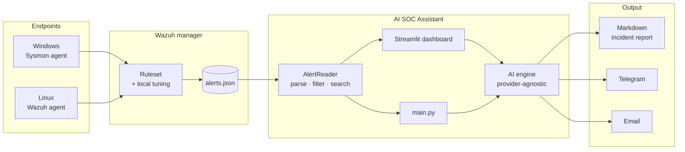
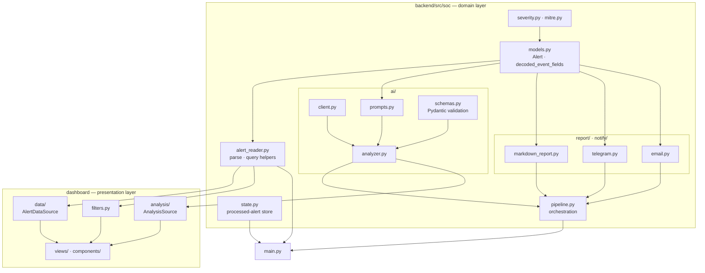
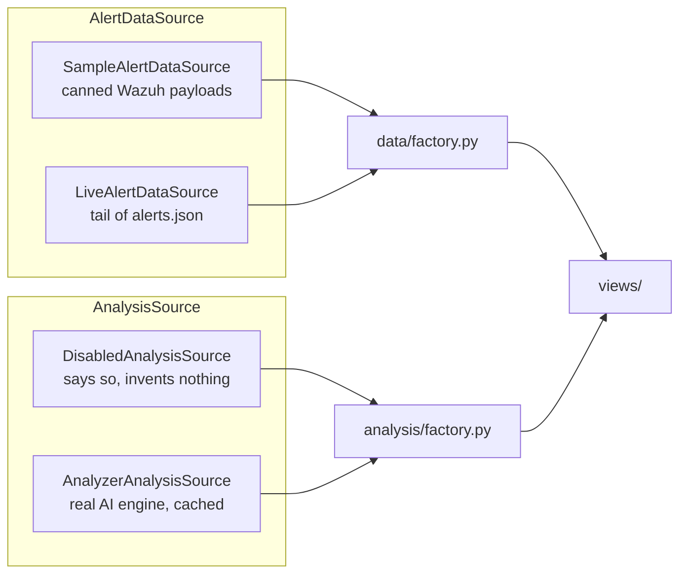
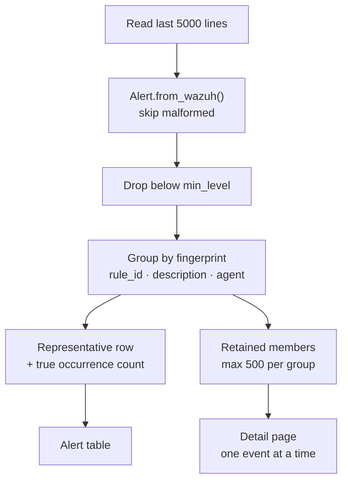
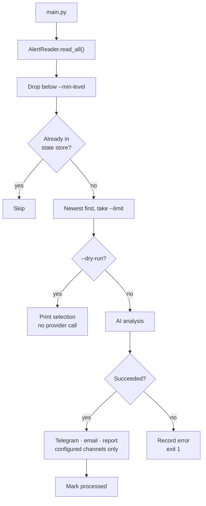
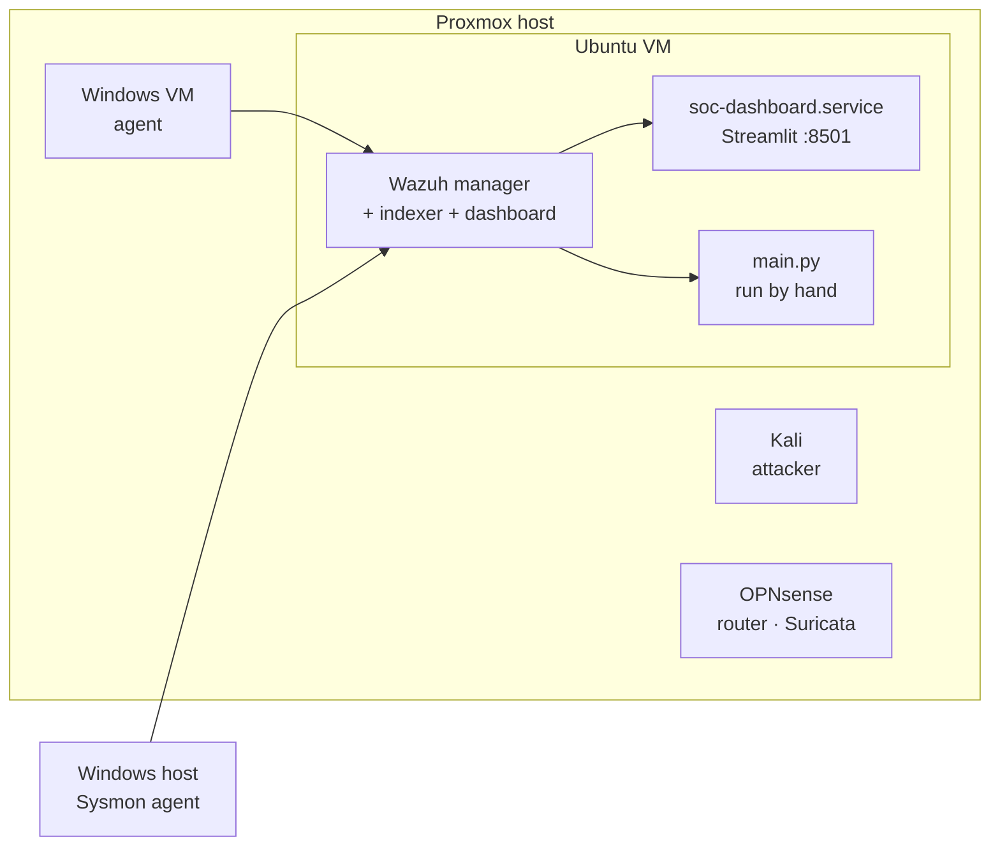

# Architecture

Diagrams are Mermaid; GitHub renders them inline.

---

## 1. End to end



The assistant reads what Wazuh has already detected. It adds no detection of
its own — the ruleset decides what becomes an alert, and local tuning decides
what reaches triage.

---

## 2. Module layout



**Dependency direction is one-way.** The dashboard imports from `soc`; `soc`
never imports from the dashboard. When the prompt builder, the report and both
notifiers all needed the same Sysmon field extraction, the function moved into
`models.py` rather than being imported upward or duplicated.

---

## 3. Swappable layers

Two `Protocol` definitions isolate the dashboard from concrete implementations.



Adding the live Wazuh source in Sprint 4.3a meant registering it in one
factory function. No view changed.

The `AlertDataSource` surface:

```python
name: str
is_live: bool
occurrences: dict[str, int]
fetch_alerts(limit: int) -> list[Alert]
fetch_group(alert_id: str) -> list[Alert]
```

---

## 4. Deduplication and group expansion



A row in the table stands for a group. The occurrence count is the **true**
number seen in the window, not the number retained — which is why the UI says
"showing 50 of 304 occurrences seen in the current window" rather than
implying a total the read window cannot support.

Filters run on the representatives, after the counts are built. Filtering
earlier would make the count mean "times seen matching this filter".

---

## 5. Command-line run



The state store answers one question: *have I handled this alert id before?*
Without it, a scheduled run would re-analyse everything still inside the read
window — paying the provider again and re-sending the same notification.

Whether a *rule* is too noisy is a detection tuning problem, deliberately kept
out of the state layer.

---

## 6. Cost controls

Every analysis is a paid API call, so the boundaries are explicit:

| Control | Where | Effect |
|---|---|---|
| Result cache keyed by alert id | `analysis/analyzer_source.py` | Re-rendering a page never re-bills |
| Fingerprint deduplication | `data/live.py` | 304 identical alerts, one analysis |
| Processed-alert store | `soc/state.py` | Repeat runs skip handled alerts |
| `--limit` defaults to 1 | `main.py` | An accidental run bills the minimum |
| `--dry-run` | `main.py` | Inspect the selection for free |
| Rule tuning | `local_rules.xml` | Noise never reaches the pipeline |

At roughly $0.004 per alert, an untuned rule firing 175 times a day would cost
more than the analysis is worth — which is why tuning precedes automation.

---

## 7. Deployment



The assistant reads `alerts.json` directly, so it runs on the manager host.
Moving to the Wazuh REST API would remove that constraint — it is on the
roadmap.

Systemd runs the dashboard:

```
Environment="DASHBOARD_SOURCE=live"
Environment="DASHBOARD_ANALYSIS_SOURCE=analyzer"
SupplementaryGroups=wazuh
```

No timer ships with the project. `main.py` is scheduler-ready — it skips
handled alerts and signals failure through its exit code — but automation
multiplies alert volume, so tuning comes first.
